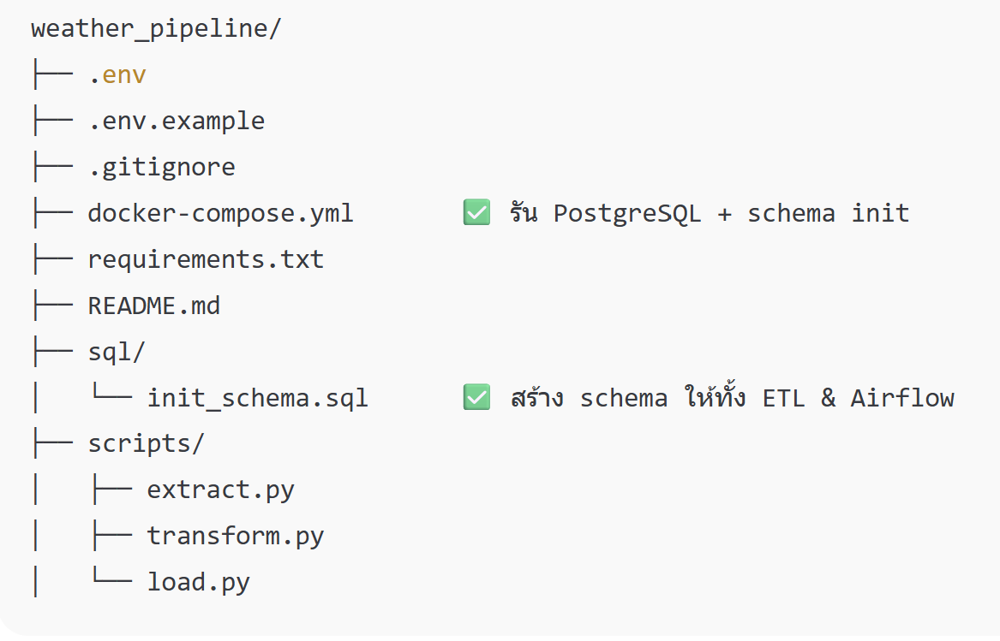

# Weather Pipeline 🌦️

ETL pipeline สำหรับดึงข้อมูลสภาพอากาศจาก Weatherstack API และโหลดเข้า PostgreSQL ด้วย Docker + Python.

## Features

- Extract → Transform → Load (ETL)
- ใช้ `.env` สำหรับความปลอดภัย
- รัน PostgreSQL ผ่าน Docker
- พร้อมต่อยอด Airflow + Monitoring

## Structure
weather_pipeline/
├── .env
├── .env.example
├── .gitignore
├── requirements.txt
├── docker-compose.yml       ✅ รัน PostgreSQL + schema init
├── sql/
│   └── init_schema.sql      ✅ สร้าง schema ให้ทั้ง ETL & Airflow
├── scripts/
│   ├── extract.py
│   ├── transform.py
│   └── load.py
├── README.md



## Getting Started
```bash
docker-compose up -d
python scripts/load.py

docker-compose down -v  # ลบ container + volume (ต้องใช้ -v)
docker-compose up -d    # รันใหม่ จะสร้าง schema ให้อัตโนมัติ
